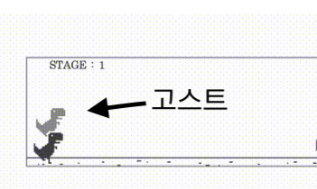

# 웹 소켓 게임 만들기 (DINO GAME)


## 프로젝트 소개

### 프로젝트 구조

```
📁 ROOT
├── 📁 docs                                 // README 관련
│   └── img
│       ├── dino_game_img.png
│       └── dino_play.gif
├── package-lock.json
├── package.json
├── 📁 public                               // 프론트 관련
│   ├── CactiController.js
│   ├── Cactus.js
│   ├── Constants.js
│   ├── Ghost.js
│   ├── Ground.js
│   ├── Item.js
│   ├── ItemController.js
│   ├── Player.js
│   ├── Score.js
│   ├── Socket.js
│   ├── 📁 assets                           // 데이터 관련
│   │   ├── item.json
│   │   ├── item_unlock.json
│   │   └── stage.json
│   ├── 📁 audios                           // 오디오 관련
│   │   ├── coin.mp3
│   │   ├── game_bgm.mp3
│   │   ├── game_bgm2.mp3
│   │   ├── game_over.mp3
│   │   └── game_over_new_record.mp3
│   ├── 📁 images                           // 이미지 관련
│   │   ├── cactus_1.png
│   │   ├── cactus_2.png
│   │   ├── cactus_3.png
│   │   ├── dino_run1.png
│   │   ├── dino_run2.png
│   │   ├── ghost_run1.png
│   │   ├── ghost_run2.png
│   │   ├── ghost_standing_still.png
│   │   ├── ground.png
│   │   ├── happy_rtan.gif
│   │   ├── 📁 items
│   │   │   ├── pokeball_cyan.png
│   │   │   ├── pokeball_orange.png
│   │   │   ├── pokeball_pink.png
│   │   │   ├── pokeball_purple.png
│   │   │   ├── pokeball_red.png
│   │   │   └── pokeball_yellow.png
│   │   ├── sprite_sheet.png
│   │   ├── standing_still.png
│   │   └── standing_still_eye_closed.png
│   ├── index.html
│   ├── index.js
│   └── style.css
├── readme.md
└── 📁 src                                  // 서버 관련
    ├── app.js
    ├── constants.js
    ├── 📁 handlers                         // 핸들러 관련
    │   ├── game.handler.js
    │   ├── handlerMapping.js
    │   ├── helper.js
    │   ├── item.handler.js
    │   ├── rank.handler.js
    │   ├── register.handler.js
    │   └── stage.handler.js
    ├── 📁 init                             // 서버 실행 시 동작
    │   ├── assets.js
    │   ├── redis.js
    │   └── socket.js
    ├── 📁 models                           // 데이터 관련
    │   ├── itemLog.model.js
    │   ├── rank.model.js
    │   ├── stage.model.js
    │   └── user.model.js
    └── 📁 utils                            // 유틸 관련
        └── score.util.js
```

### 추가 기능 : 고스트 모드



- 최고 기록 달성 시, 해당 플레이어의 기록을 서버에 저장한다.
- 게임을 시작할 때, 최고 점수 및 플레이어의 기록을 받아와서 화면에 그려준다.

---

## 과제 내용

### 필수 기능

- [x] 스테이지 구분
- [x] 스테이지에 따른 점수 획득 구분
- [x] 스테이지에 따라 아이템이 생성
- [x] 아이템 획득 시 점수 획득
- [x] 아이템 별 획득 점수 구분

### 도전 기능

- [x] Broadcast 기능 추가
- [x] 가장 높은 점수 Record 관리
- [x] 유저 정보 연결
- [x] Redis 연동, 게임 정보 저장

---

## 음원

- https://pixabay.com/ko/sound-effects/
